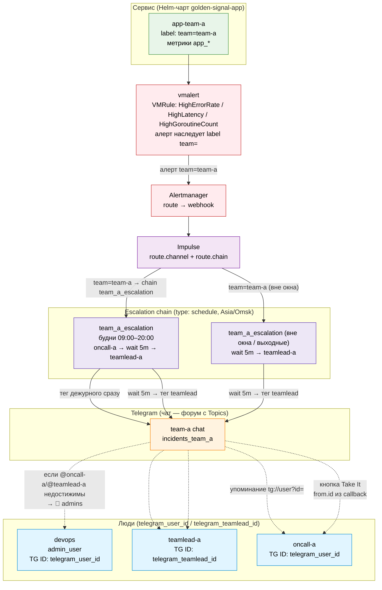

# Шаблонизация правил алертов в Helm и их обработка через vmalert и Impulse для отправки в Telegram

## Цель статьи

Показать, как отправлять и маршрутизировать алерты от сервиса в Telegram-чат команды. На примере demo-приложения Golden Signal и стека VictoriaMetrics разбирается: шаблонизация правил алертов в Helm, маршрутизация алертов через vmalert + Alertmanager и доставка уведомлений в Telegram через Impulse.

## Зачем Impulse, если есть Alertmanager

Alertmanager — это stateless-«почтальон»: сгруппировал алерты, отправил в receiver (webhook/email/…), забыл. Состояния инцидента наружу он не экспортирует и интерактивности с пользователем не предоставляет. Impulse — это слой инцидент-менеджмента поверх Alertmanager: он принимает алерты как webhook-ресивер и превращает их в управляемые инциденты прямо внутри Telegram.

| Возможность | Alertmanager | Impulse |
|---|---|---|
| Группировка и дедупликация алертов (`group_by`, `group_interval`, `repeat_interval`, `inhibit_rules`) | ✅ встроено | — (получает уже сгруппированные алерты от Alertmanager) |
| Маршрутизация по receiver'ам через `route.routes` + `matchers` (severity/service/team → разные webhook'и/чаты) | ✅ встроено | ✅ дополнительно через `impulseConfig.channels` + `route.channel` (отправка в Telegram-чат команды) |
| HA (cluster mode, gossip-протокол) | ✅ встроено (`--cluster.*`) | ✅ собственный HA-режим с файловым локом (primary/standby, `/readyz` 503 у standby) |
| Инцидент = отдельный топик форума Telegram (`createForumTopic`), все обновления в одном треде | ❌ нет (плоский поток сообщений в чат) | ✅ |
| Интерактивные inline-кнопки Take It / Freeze с callback на `impulse_address` (HTTPS webhook) | ❌ нет | ✅ |
| Жизненный цикл инцидента (new → ack/freeze → resolved) с синхронизацией состояния с топиком | ❌ нет (stateless по доставке: отправил и забыл) | ✅ |
| Привязка Telegram-пользователей к admin-user'ам (`users.<name>.id = telegram_user_id`) для эскалаций и упоминаний конкретным людям | ❌ нет (чужая зона ответственности) | ✅ |

**Кратко:** Alertmanager здесь выступает только маршрутизатором-источником (`receiver: impulse` → webhook на Impulse). Всю работу с пользователем внутри Telegram — треды, кнопки, состояния инцидента, привязку людей — делает Impulse.

> **Перед шагами ниже** разверните kubernetes и установите cert-manager. Дальнейшие шаги предполагают, что кластер K8s работает, ingress-nginx слушает на публичном IP, cert-manager установлен, а ClusterIssuer `letsencrypt-prod` применён.

## Порядок развёртывания

### 1. Подготовка файла конфигурации victoria-metrics-k8s-stack

Файл vmks-values.yaml уже создан terraform.

### 2. VM K8s Stack (метрики, Grafana)

```bash
helm upgrade --install vmks \
  oci://ghcr.io/victoriametrics/helm-charts/victoria-metrics-k8s-stack \
  --namespace vmks \
  --create-namespace \
  --wait \
  --version 0.90.2 \
  --timeout 15m \
  -f values/vmks-values.yaml
```

### 2. Установка demo-приложения Golden Signal через Helm

Demo-приложение Golden Signal написано на **Go** (`app/main.go`).

Исходники:
- Helm-чарт: https://github.com/patsevanton/alert-templates-helm-vmalert-impulse/tree/main/chart
- Приложение на Go: https://github.com/patsevanton/alert-templates-helm-vmalert-impulse/tree/main/app

Приложение:

- Экспонирует HTTP-эндпоинты `/` (health) и `/work` (обработка запроса со случайной задержкой 100–499 мс и ~20% случайных ошибок).
- Экспортирует Prometheus-метрики на `/metrics`:
  - `app_requests_total` — счётчик входящих HTTP-запросов (counter);
  - `app_errors_total` — счётчик ответов с ошибкой (counter);
  - `app_request_latency_seconds` — гистограмма времени обработки запроса (histogram);
  - `app_goroutines` — текущее число горутин, индикатор насыщения (gauge).
- Запускает фоновый генератор трафика: каждые 2 с отправляет запрос на `/work`, чтобы метрики и алерты обновлялись постоянно.

Правила алертов задаются как **VMRule** (Custom Resource VictoriaMetrics) — манифест `chart/templates/vmrule.yaml` (исходный код: https://github.com/patsevanton/alert-templates-helm-vmalert-impulse/blob/main/chart/templates/vmrule.yaml). VMRule применяется в кластер **вместе с установкой приложения** одним `helm upgrade --install`, отдельного шага для алертов нет. vmalert автоматически подхватывает VMRule через `selectAllByDefault: true`.

Правила алертов (группа `golden-signal-alerts`):

| Алерт | Условие | For | Severity |
|---|---|---|---|
| `HighErrorRate` | `rate(app_errors_total[5m]) / rate(app_requests_total[5m]) > 0.05` | 1m | critical |
| `HighLatency` | `histogram_quantile(0.95, sum(rate(app_request_latency_seconds_bucket[5m])) by (le)) > 0.5` | 2m | warning |
| `HighGoroutineCount` | `app_goroutines > 50` | 1m | warning |

Каждый алерт несёт label `team` (`team-a`), по которому Impulse направляет инцидент в Telegram-чат команды (`route.channel` + `chain` в `values/values-impulse.yaml.tftpl`). Приложение устанавливается **одним релизом**:

```bash
# Релиз команды team-a (алерты с label team=team-a → чат incidents_team_a)
helm upgrade --install golden-signal-app-a ./chart \
  --namespace golden-signal-app \
  --create-namespace \
  --set team=team-a
```

### Проверка статуса развертывания

```bash
kubectl get pods -n golden-signal-app -l app=golden-signal-app
```

### Проверка метрик

```bash
kubectl port-forward -n golden-signal-app svc/golden-signal-app-a 8080:8080
curl http://localhost:8080/metrics
curl http://localhost:8080/work
```

### 3. Настройка Telegram-бота

Для отправки уведомлений в Telegram потребуется бот и значения: `bot-token`, `telegram_chat_id` (чат team-a), `telegram_user_id`, `telegram_teamlead_id`, `telegram_support_oncall_id`.

#### Если у вас нет Telegram-бота

Создайте бота и получите его токен:

1. Напишите [@BotFather](https://t.me/BotFather) команду `/newbot`
2. Задайте имя и username бота (username должен оканчиваться на `bot`)
3. BotFather вернёт `bot-token` вида `123456789:ABCdefGhI-jklMnoPQRstuVwxYZ`
4. Добавьте созданного бота в чат команды (бот должен быть участником группы)

#### Если у вас уже есть Telegram-бот

Пропустите раздел выше. Если `bot-token` этого бота у вас уже есть — переходите к следующему шагу. Если токен утерян, получите его заново:

1. Напишите [@BotFather](https://t.me/BotFather) команду `/token`
2. Выберите нужного бота из списка
3. BotFather вернёт новый `bot-token` вида `123456789:ABCdefGhI-jklMnoPQRstuVwxYZ`
4. Добавьте бота в чат команды (если ещё не добавлен)

#### Получение `telegram_chat_id`, `telegram_user_id`, `telegram_teamlead_id`

1. Получите `telegram_chat_id` — ID чата/группы команды team-a, куда будут отправляться уведомления:
   - Добавьте бота [@myidbot](https://t.me/myidbot) в ваш чат/группу team-a
   - Отправьте сообщение `/getgroupid@myidbot` в чат/группу
   - Бот вернёт `Your group ID is: -xxxxx` — это и есть `telegram_chat_id`
2. Получите `telegram_user_id` для администратора:
   - Напишите боту [@userinfobot](https://t.me/userinfobot) в личные сообщения команду `/start`
   - Бот вернёт ваш `id` — это и есть `telegram_user_id`
3. Получите `telegram_teamlead_id` — Telegram `user_id` teamlead:
    - Teamlead пишет боту [@userinfobot](https://t.me/userinfobot) команду `/start` из своего аккаунта
    - Бот вернёт `id` teamlead — это и есть `telegram_teamlead_id`
    - Если teamlead и администратор — один и тот же человек, `telegram_teamlead_id` совпадает с `telegram_user_id`
4. Получите `telegram_support_oncall_id` — Telegram `user_id` дежурного техподдержки (последняя ступень эскалации, тегается через 5 минут после teamlead, если никто не нажал **Take It**):
    - Дежурный техподдержки пишет боту [@userinfobot](https://t.me/userinfobot) команду `/start` из своего аккаунта
    - Бот вернёт `id` — это и есть `telegram_support_oncall_id`
    - Если дежурный техподдержки и администратор — один и тот же человек, `telegram_support_oncall_id` совпадает с `telegram_user_id`

#### Включение топиков (форума) в группах Telegram

Impulse реализует инциденты в Telegram как **топики (темы) форума**: для каждого инцидента создаётся отдельная тема через Telegram API `createForumTopic`. В обычном чате без включённых топиков отправка алертов завершится ошибкой `Bad Request: the chat is not a forum` / `Incident creation aborted: failed to create thread`. Поэтому чат команды (team-a) обязательно должен быть супергруппой с включёнными Topics.

Настройка группы:

1. Откройте ваш чат/группу → меню → **Manage group**
2. Включите **Topics** (это преобразует чат в форум-супергруппу; `telegram_chat_id` при этом не меняется — повторно получать ID не нужно)
3. Добавьте бота Impulse в группу (если ещё не добавлен)
4. Повысьте бота до администратора и включите право **Manage topics**

#### Вписывание значений и создание Secret

1. Создайте файл `terraform.tfvars` в корне репозитория со значениями (файл уже в `.gitignore`, значения не попадут в git):

```bash
cat > terraform.tfvars <<'EOF'
telegram_chat_id           = "<ID чата team-a>"
telegram_user_id           = "<ваш telegram_user_id>"
telegram_teamlead_id       = "<telegram_user_id teamlead>"
telegram_support_oncall_id = "<telegram_user_id дежурного техподдержки>"
bot_token                  = "<ваш bot-token вида 123456789:ABCdefGhI-jklMnoPQRstuVwxYZ>"
EOF
```

2. Перегенерируйте values и манифест Secret с токеном бота:

```bash
terraform apply
```

> `terraform apply` рендерит файл `impulse-telegram-secret.yaml` (манифест Namespace `impulse` + Secret `impulse-telegram-secrets` с ключом `bot-token`) из переменной `bot_token`. Токен кодируется в base64 и не светится в values-файле. Сам файл `impulse-telegram-secret.yaml` добавлен в `.gitignore`.

3. Примените манифест Secret в кластере вручную:

```bash
kubectl apply -f impulse-telegram-secret.yaml
```

> Secret `impulse-telegram-secrets` в namespace `impulse` создаётся вручную через `kubectl apply -f impulse-telegram-secret.yaml` после `terraform apply`. Terraform не вызывает kubectl напрямую — это избегает ошибок доступа к API кластера во время `apply`. При смене `bot_token` в `terraform.tfvars` повторный `terraform apply` перегенерирует `impulse-telegram-secret.yaml`, после чего его нужно повторно применить `kubectl apply -f impulse-telegram-secret.yaml`.

### 4. Установка Impulse

Для установки Impulse через Helm используйте следующие команды:

```bash
helm repo add impulse https://eslupmi-community.github.io/helm-charts
helm repo update
helm install my-impulse impulse/impulse \
  --version 1.0.15 \
  --namespace impulse \
  --create-namespace \
  -f values/values-impulse.yaml
```

Шаблон values: [`values/values-impulse.yaml.tftpl`](values/values-impulse.yaml.tftpl) (рендерится в `values/values-impulse.yaml`).

## Доступ к сервисам

URL формируются через sslip.io из публичного IP балансировщика ingress-nginx (IP берётся из `terraform output lb_ip`). TLS через cert-manager + Let's Encrypt:

- **Grafana**: `https://grafana.<LB_IP>.sslip.io`
- **VictoriaMetrics**: `https://vmsingle.<LB_IP>.sslip.io`
- **Alertmanager**: `https://alertmanager.<LB_IP>.sslip.io`
- **vmalert**: `https://vmalert.<LB_IP>.sslip.io`
- **Impulse**: `https://impulse.<LB_IP>.sslip.io`

Для получения пароля admin от Grafana:

```bash
terraform output -raw grafana_admin_password_command | sh
```

> sslip.io — бесплатный wildcard-DNS: `<anything>.<IP>.sslip.io` всегда резолвится в `<IP>`. Не требует делегирования доменной зоны.

## Как работает привязка Telegram-пользователей в Impulse (`users.<name>.id` и `admin_users`)

В `values/values-impulse.yaml.tftpl` секция `impulseConfig.messenger` содержит:

```yaml
admin_users: ["admin_user"]
users:
  admin_user:
    id: "${telegram_user_id}"          # числовой Telegram user_id администратора
  team_a_teamlead:
    id: "${telegram_teamlead_id}"      # числовой Telegram user_id teamlead
  support_oncall:
    id: "${telegram_support_oncall_id}" # числовой Telegram user_id дежурного техподдержки
  team_a_oncall:
    id: "${telegram_user_id}"          # дежурный team-a (те же люди, что и teamlead/admin)
```

**Назначение `users.<name>.id`** — это **числовой Telegram `user_id`** (положительное число). Используется **не для адресации кнопок callback**, а для:

1. **Пред-регистрации пользователя в `UserManager`** Impulse — `user_id` становится первичным ключом, через Telegram API `getChat` подгружаются `full_name`/`username`. Без записи в `users` тоже работает: Impulse узнаёт пользователя при первом его действии через `from.id` из callback-пейлоада.
2. **Адресации по имени в эскалационных цепочках** — chain-step `user: <config_name>` резолвится в `user_id` через `UserManager`.
3. **`admin_users`** — список **имён (ключей из `users`)** (валидируется, что каждое имя есть в `users`). Администраторы упоминаются в текстах уведомлений как `tg://user?id=<id>` (фолбэк-канал для алертов и предупреждений).
4. **Упоминаний в текстах** — `<a href="tg://user?id={{ id }}">` в шаблонах Impulse превращается в пуш-уведомление конкретному человеку в Telegram.
5. **Обратного сопоставления `user_id → config_name`** — для refresh-задач и UI.

> Teamlead объявляется ключом `team_a_teamlead`, на него ссылается эскалационная цепочка по имени. Аналогично объявлен дежурный `team_a_oncall` — тот же человек, что и teamlead/admin_user.

> **Кнопки callback в Telegram не имеют адресации конкретному человеку.** Inline-кнопки (`Take It` / `Freeze` и т.п.) видны всем участникам группы, `callback_data` содержит только команду (`stop_chain`, `start_chain`, …) без `user_id`. В момент клика Telegram сам сообщает в callback-пейлоаде `from.id` нажавшего — Impulse привязывает инцидент к этому `user_id` уже в момент нажатия, а не из конфига.

**`impulse_address`** (`https://impulse.<LB_IP>.sslip.io`) — это **публичный HTTPS-URL инстанса Impulse**, куда Telegram шлёт POST'ом все `callback_query` и сообщения (регистрируется через Telegram API `setWebhook` с `url = {impulse_address}/app`). Это транспортный endpoint для приёма callback'ов от Telegram, **не механизм адресации людям** — Telegram поддерживает webhook только по HTTPS, поэтому TLS обязателен.

## Эскалация инцидентов и дежурства (schedule chains)

Impulse поддерживает эскалационные цепочки — последовательность шагов уведомления, которая запускается при создании инцидента и останавливается, когда кто-то нажимает кнопку **Take It** (или замораживает инцидент **Freeze**). Пока никто не отреагировал, цепочка продолжает выполняться по расписанию шагов.

В проекте цепочки реализованы как **schedule chains** — расписание дежурств с тайм-зоной `Asia/Omsk`. Последней ступенью цепочки вызывается вложенная schedule-chain `support_escalation` — тегается дежурный техподдержки (24/7, без матчеров, одна fallback-ветка с шагом `user: support_oncall`).

- **Будни 09:00–20:00** (окно дежурства, 11 часов): инцидент → тег дежурного сразу → wait 5m → тег teamlead → wait 5m → тег support_oncall.
- **Вне окна** (будни 20:00–09:00 и выходные Сб/Вс): инцидент → wait 5m → тег teamlead → wait 5m → тег support_oncall.

```yaml
chains:
  support_escalation:
    # Вложенная schedule-chain дежурного техподдержки — 24/7, без матчеров
    # (одна fallback-ветка). Тегает support_oncall в текущем чате инцидента.
    # Вызывается как шаг `chain: support_escalation` в team_a_escalation
    # после teamlead.
    type: schedule
    timezone: Asia/Omsk
    schedule:
      - steps:
          - user: support_oncall
  team_a_escalation:
    type: schedule
    timezone: Asia/Omsk
    schedule:
      # Будни 09:00–20:00: дежурный → teamlead через 5m → support_oncall через 5m
      - matcher:
          start_day_expr: dow
          start_day_values: ["Mon", "Tue", "Wed", "Thu", "Fri"]
          start_time: "09:00"
          duration: 11h
        steps:
          - user: team_a_oncall
          - wait: 5m
          - user: team_a_teamlead
          - wait: 5m
          - chain: support_escalation
      # Вне окна дежурства (будни 20:00–09:00, выходные): teamlead через 5m → support_oncall через 5m
      - steps:
          - wait: 5m
          - user: team_a_teamlead
          - wait: 5m
          - chain: support_escalation
```

**Логика:**

1. Инцидент создаётся в чате команды (`incidents_team_a`) — все участники видят сообщение с кнопками Take It / Freeze. Impulse оценивает матчеры schedule-chain сверху вниз, первый совпавший выбирает steps.
2. **В окно дежурства** (будни 09:00–20:00): дежурный тегается сразу (`user: team_a_oncall` → `tg://user?id=<id>` → push-уведомление). Если в течение 5 минут никто не нажал **Take It** — тегается teamlead. Если и через 5 минут после teamlead никто не взял — тегается дежурный техподдержки (`chain: support_escalation` → `user: support_oncall`).
3. **Вне окна дежурства**: teamlead тегается через 5 минут (дежурного нет, teamlead заменяет), ещё через 5 минут — дежурный техподдержки.
4. Нажатие **Take It** в любой момент останавливает цепочку (`stops chain escalation` — support_oncall не тегается, если инцидент уже взяли в работу).

> **support_oncall тегается в ТОМ ЖЕ чате инцидента** (`incidents_team_a`), отдельного чата техподдержки нет. Impulse не поддерживает шаг `channel` в schedule-chain (шаги только `user`/`user_group`/`group`/`webhook`/`chain`/`wait`), а шаг `user` постит в текущий чат инцидента, не создаёт новый инцидент в другом канале.

> Schedule-chain в Impulse поддерживает `dow` (день недели), `dom` (день месяца), `date` (точная дата) и modulus-выражения (`dow % 2` для чередования). Матчеры оцениваются сверху вниз, ветка без `matcher` — fallback (срабатывает, если ни один матчер не совпал). Подробнее — в [документации Impulse](https://eslupmi-community.github.io/impulse/config_file/#schedule-chains).

> Шаг `user` упоминает пользователя в сообщении инцидента в текущем чате (не в личку). Для отправки в личные сообщения нужно, чтобы пользователь предварительно начал диалог с ботом (Telegram Bot API требует `/start` от пользователя перед отправкой ему сообщений).

## Маршрутизация алертов в чат команды (route)

Алерт несёт label `team` (`team-a`), который выставляется в `chart/templates/vmrule.yaml` из `chart/values.yaml` (`team: team-a` по умолчанию). Impulse направляет инцидент в чат команды через `route.channel` + `route.chain`:

```yaml
route:
  channel: "incidents_team_a"       # канал команды team-a
  chain: "team_a_escalation"         # цепочка эскалации команды
```

## Схема адресации инцидентов в Telegram

Сценарий: сервис `golden-signal-app` с `team=team-a` → команда разработки (`teamlead` + `oncall`-дежурный) + чат команды в Telegram. Канал выбран в `route.channel` Impulse; порядок уведомлений внутри чата задаётся schedule-chain.



### Легенда связей

- **Сплошные** — прохождение алерта: сервис → `vmalert` (срабатывание VMRule, алерт получает `team=`) → `Alertmanager` (route) → `Impulse` (route.channel + route.chain) → чат команды в Telegram.
- **Сплошные через chains** — порядок эскалации внутри чата: schedule-chain (Asia/Omsk) в будни 09:00–20:00 тегает `oncall` сразу, через 5 минут — `teamlead`; вне этого окна (будни 20:00–09:00 и выходные) `oncall` отсутствует, остаётся `wait 5m → teamlead`. Матчеры оцениваются сверху вниз, ветка без matcher — fallback.
- **Пунктирные** — упоминания/адресация: `tg://user?id=<id>` подсвечивает конкретным людям пуш в треде инцидента; кнопка `Take It` адресуется по `from.id` нажавшего (узнаётся в момент клика, не заранее).
- **`admin_users`** получает `🔔 admins` только как фолбэк: если целевой пользователь из цепочки недостижим (`NotDefined`/`NotFound`) или инцидент перешёл в `unknown`.

> В демо-инфраструктуре `oncall-a` и `admin_user` свернуты в один `telegram_user_id` (один физический аккаунт), а `teamlead-a` — это `telegram_teamlead_id`. Схема изображает их как отдельных людей; в проде каждому соответствует свой TG ID.

### Сценарии срабатывания фолбэка `🔔 admins`

| # | Сценарий | Категория | Поведение Telegram / Impulse |
|---|---|---|---|
| 1 | Юзер не зарегистрирован в `users.<name>.id` в конфиге Impulse | Конфигурация | `UserManager` возвращает `NotDefined` |
| 2 | `users.<name>.id` указан, но TG `user_id` невалиден (опечатка, удалённый аккаунт) | Конфигурация | `NotFound` |
| 3 | Юзер сам вышел из чата команды (`status: left`) | Чат | `getChatMember` → `left`, упоминание не доставлено |
| 4 | Юзера кикнули из чата (`status: kicked`) | Чат | `getChatMember` → `kicked`, упоминание не доставлено |
| 5 | Юзер в рестрикшене — не получает пуш-уведомления об упоминаниях | Чат | `getChatMember` → `restricted`, пуш заглушён |
| 6 | Бот потерял права админа в чате — не может отправлять сообщения/упоминания | Чат | `sendMessage` → `403 Forbidden` |
| 7 | Юзер заблокировал бота в DM | DM | `sendMessage` → `403 Forbidden: bot was blocked by the user` |
| 8 | Юзер удалил/деактивировал аккаунт Telegram | DM | `sendMessage` → `403 Forbidden: user is deactivated` |
| 9 | Юзер запретил писать ему в DM (privacy setting) | DM | `sendMessage` → `403 Forbidden: chat not found` |
| 10 | Инцидент перешёл в `unknown` (алерт от vmalert перестал приходить, но Impulse не получил явного resolved) | Статус инцидента | Impulse не может определить состояние, эскалация на админов |
| 11 | Impulse потерял webhook от Alertmanager / сетевой сбой | Статус инцидента | Инцидент «завис» без обновлений, эскалация на админов |
