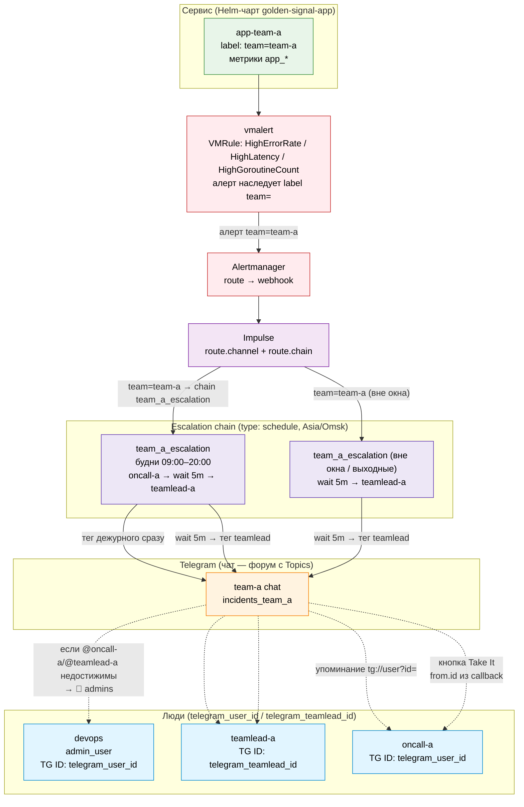

# Схема адресации инцидентов в Telegram

Сценарий: сервис `golden-signal-app` с `team=team-a` → команда разработки (`teamlead` + `oncall`-дежурный) + чат команды в Telegram. Канал выбран в `route.channel` Impulse; порядок уведомлений внутри чата задаётся schedule-chain.

## Легенда связей

- **Сплошные** — прохождение алерта: сервис → `vmalert` (срабатывание VMRule, алерт получает `team=`) → `Alertmanager` (route) → `Impulse` (route.channel + route.chain) → чат команды в Telegram.
- **Сплошные через chains** — порядок эскалации внутри чата: schedule-chain (Asia/Omsk) в будни 09:00–20:00 тегает `oncall` сразу, через 5 минут — `teamlead`; вне этого окна (будни 20:00–09:00 и выходные) `oncall` отсутствует, остаётся `wait 5m → teamlead`. Матчеры оцениваются сверху вниз, ветка без matcher — fallback.
- **Пунктирные** — упоминания/адресация: `tg://user?id=<id>` подсвечивает конкретным людям пуш в треде инцидента; кнопка `Take It` адресуется по `from.id` нажавшего (узнаётся в момент клика, не заранее).
- **`admin_users`** получает `🔔 admins` только как фолбэк: если целевой пользователь из цепочки недостижим (`NotDefined`/`NotFound`) или инцидент перешёл в `unknown`.

> В демо-инфраструктуре `oncall-a` и `admin_user` свернуты в один `telegram_user_id` (один физический аккаунт), а `teamlead-a` — это `telegram_teamlead_id`. Схема изображает их как отдельных людей; в проде каждому соответствует свой TG ID.

### Сценарии срабатывания фолбэка `🔔 admins`

| # | Сценарий | Категория | Поведение Telegram / Impulse |
|---|---|---|---|
| 1 | Юзер не зарегистрирован в `users.<name>.id` в конфиге Impulse | Конфигурация | `UserManager` возвращает `NotDefined` |
| 2 | `users.<name>.id` указан, но TG `user_id` невалиден (опечатка, удалённый аккаунт) | Конфигурация | `NotFound` |
| 3 | Юзер сам вышел из чата команды (`status: left`) | Чат | `getChatMember` → `left`, упоминание не доставлено |
| 4 | Юзера кикнули из чата (`status: kicked`) | Чат | `getChatMember` → `kicked`, упоминание не доставлено |
| 5 | Юзер в рестрикшене — не получает пуш-уведомления об упоминаниях | Чат | `getChatMember` → `restricted`, пуш заглушён |
| 6 | Бот потерял права админа в чате — не может отправлять сообщения/упоминания | Чат | `sendMessage` → `403 Forbidden` |
| 7 | Юзер заблокировал бота в DM | DM | `sendMessage` → `403 Forbidden: bot was blocked by the user` |
| 8 | Юзер удалил/деактивировал аккаунт Telegram | DM | `sendMessage` → `403 Forbidden: user is deactivated` |
| 9 | Юзер запретил писать ему в DM (privacy setting) | DM | `sendMessage` → `403 Forbidden: chat not found` |
| 10 | Инцидент перешёл в `unknown` (алерт от vmalert перестал приходить, но Impulse не получил явного resolved) | Статус инцидента | Impulse не может определить состояние, эскалация на админов |
| 11 | Impulse потерял webhook от Alertmanager / сетевой сбой | Статус инцидента | Инцидент «завис» без обновлений, эскалация на админов |
