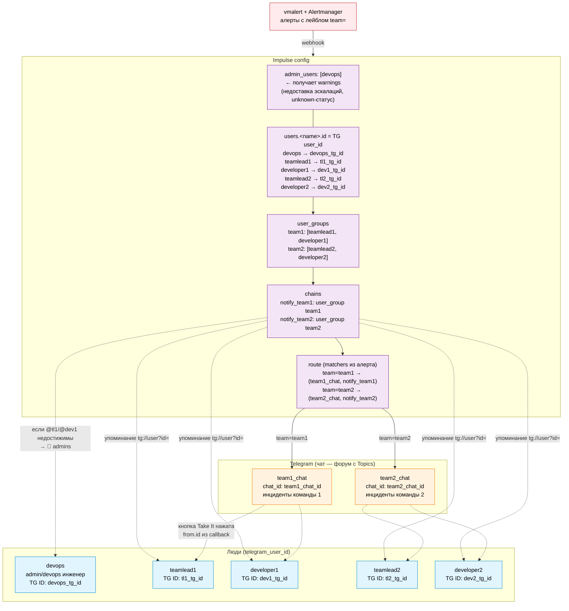

# Схема адресации инцидентов в Telegram через Impulse

Сценарий: 1 admin/devops-инженер + 2 команды разработки (teamlead + developer) + 2 чата команд в Telegram.



## Легенда связей

- **Сплошные** — маршрутизация: vmalert → Impulse → `route` (по `matchers`) → `channel` (чат команды).
- **Пунктирные** — упоминания/адресация: `chains` через `tg://user?id=<id>` подсвечивают конкретным людям пуш в треде инцидента.
- **`admin_users`** получает `🔔 admins` только как фолбэк: если целевой пользователь из цепочки недостижим (`NotDefined`/`NotFound`) или инцидент перешёл в `unknown`.
- **Кнопки callback** не адресуются заранее — `from.id` нажавшего узнаётся в момент клика от Telegram, не из конфига.

## Назначение сущностей Impulse

| Сущность | Привязка | Что адресует |
|---|---|---|
| `users.<name>.id` | = Telegram `user_id` человека | Пред-регистрация в `UserManager`, адресация эскалаций `user: <name>`, упоминания `tg://user?id=<id>` |
| `admin_users` | список имён из `users` | Получатели warning-уведомлений (фолбэк при недоставке + `unknown`-статус) |
| `user_groups.<name>.users` | список имён из `users` | Массовое уведомление группы в эскалации (`user_group: <name>`) |
| `channels.<name>.id` | = Telegram `chat_id` | Куда создавать топик-инцидент (`route.channel`) |
| `route` (matchers) | поля алерта (`team=`, `service=`, `severity=`, …) | Маршрутизация: алерт → (channel, chain) |

## Пример конфига

```yaml
impulseConfig:
  messenger:
    type: "telegram"
    impulse_address: "https://impulse.${lb_ip}.sslip.io"

    admin_users: ["devops"]          # ← получает warnings

    users:
      devops:       {id: ${devops_tg_id}}      # нужен telegram_user_id админа
      teamlead1:    {id: ${tl1_tg_id}}
      developer1:   {id: ${dev1_tg_id}}
      teamlead2:    {id: ${tl2_tg_id}}
      developer2:   {id: ${dev2_tg_id}}

    user_groups:
      team1: {users: ["teamlead1", "developer1"]}
      team2: {users: ["teamlead2", "developer2"]}

    channels:
      team1_chat: {id: ${team1_chat_id}}      # telegram_chat_id чата команды 1
      team2_chat: {id: ${team2_chat_id}}      # telegram_chat_id чата команды 2

    chains:
      notify_team1:
        - user_group: team1
      notify_team2:
        - user_group: team2

  route:
    channel: team1_chat              # default
    chain:   notify_team1
    routes:
      - matchers: [team="team1"]
        channel: team1_chat
        chain:   notify_team1
      - matchers: [team="team2"]
        channel: team2_chat
        chain:   notify_team2
```

> В текущем `values/values-impulse.yaml.tftpl` описан только один `admin_user` с одним `telegram_user_id` — для сценария с 2 командами потребуется расширить секции `users` / `user_groups` / `channels` / `chains` / `route` и добавить в `terraform.tfvars` переменные для всех `telegram_user_id` и `telegram_chat_id`.
